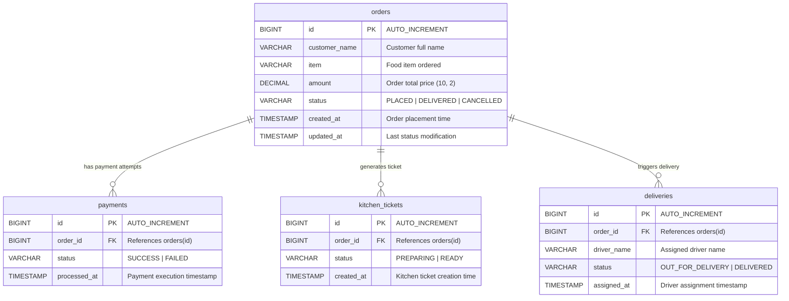

# Database Design Document
**Project:** Online Food Ordering & Microservices Processing System  
**Deliverable:** 2 of 5 (Submission Deliverables)  
**Date:** July 22, 2026  

---

## 1. Executive Summary

This document describes the database design and relational architecture for the Online Food Ordering System. The relational schema is hosted on MySQL 8.0 and managed using Flyway database migrations (`V1__init.sql`). 

The database stores state across the entire lifecycle of an order: from initial customer order creation, through payment verification, kitchen order ticket preparation, to final delivery fulfillment and driver assignment.

---

## 2. Entity Relationship (ER) Diagram

The diagram below illustrates the relational structure between the core `orders` table and its associated child domain tables (`payments`, `kitchen_tickets`, and `deliveries`).



---

## 3. Database Schema Specifications

### 3.1 `orders` Table
Stores customer details and current status of each placed food order.

| Column Name | Data Type | Constraints | Description |
|---|---|---|---|
| `id` | `BIGINT` | `PRIMARY KEY`, `AUTO_INCREMENT` | Unique Identifier for Order |
| `customer_name` | `VARCHAR(255)` | `NOT NULL` | Full name of the customer placing order |
| `item` | `VARCHAR(255)` | `NOT NULL` | Description/Name of the food item |
| `amount` | `DECIMAL(10, 2)` | `NOT NULL` | Total cost of the order |
| `status` | `VARCHAR(50)` | `NOT NULL` | Status: `PLACED`, `PAYMENT_SUCCESS`, `KITCHEN_PREPARING`, `FOOD_READY`, `OUT_FOR_DELIVERY`, `DELIVERED`, `CANCELLED` |
| `created_at` | `TIMESTAMP` | `DEFAULT CURRENT_TIMESTAMP` | Initial record timestamp |
| `updated_at` | `TIMESTAMP` | `DEFAULT CURRENT_TIMESTAMP ON UPDATE CURRENT_TIMESTAMP` | Last updated timestamp |

---

### 3.2 `payments` Table
Records payment execution logs for each order.

| Column Name | Data Type | Constraints | Description |
|---|---|---|---|
| `id` | `BIGINT` | `PRIMARY KEY`, `AUTO_INCREMENT` | Unique Payment ID |
| `order_id` | `BIGINT` | `NOT NULL`, `FOREIGN KEY (orders.id)` | Associated Order ID |
| `status` | `VARCHAR(50)` | `NOT NULL` | Payment Status: `SUCCESS`, `FAILED` |
| `processed_at` | `TIMESTAMP` | `DEFAULT CURRENT_TIMESTAMP` | Payment execution timestamp |

---

### 3.3 `kitchen_tickets` Table
Records kitchen preparation state and order fulfillment tickets.

| Column Name | Data Type | Constraints | Description |
|---|---|---|---|
| `id` | `BIGINT` | `PRIMARY KEY`, `AUTO_INCREMENT` | Unique Kitchen Ticket ID |
| `order_id` | `BIGINT` | `NOT NULL`, `FOREIGN KEY (orders.id)` | Associated Order ID |
| `status` | `VARCHAR(50)` | `NOT NULL` | Kitchen Status: `READY` |
| `created_at` | `TIMESTAMP` | `DEFAULT CURRENT_TIMESTAMP` | Ticket creation timestamp |

---

### 3.4 `deliveries` Table
Tracks driver assignment and delivery dispatch status.

| Column Name | Data Type | Constraints | Description |
|---|---|---|---|
| `id` | `BIGINT` | `PRIMARY KEY`, `AUTO_INCREMENT` | Unique Delivery ID |
| `order_id` | `BIGINT` | `NOT NULL`, `FOREIGN KEY (orders.id)` | Associated Order ID |
| `driver_name` | `VARCHAR(255)` | `NULLABLE` | Name of assigned delivery driver |
| `status` | `VARCHAR(50)` | `NOT NULL` | Delivery Status: `DELIVERED` |
| `assigned_at` | `TIMESTAMP` | `DEFAULT CURRENT_TIMESTAMP` | Driver assignment timestamp |

---

## 4. DDL Script (`V1__init.sql`)

```sql
CREATE TABLE orders (
    id BIGINT AUTO_INCREMENT PRIMARY KEY,
    customer_name VARCHAR(255) NOT NULL,
    item VARCHAR(255) NOT NULL,
    amount DECIMAL(10, 2) NOT NULL,
    status VARCHAR(50) NOT NULL,
    created_at TIMESTAMP DEFAULT CURRENT_TIMESTAMP,
    updated_at TIMESTAMP DEFAULT CURRENT_TIMESTAMP ON UPDATE CURRENT_TIMESTAMP
);

CREATE TABLE payments (
    id BIGINT AUTO_INCREMENT PRIMARY KEY,
    order_id BIGINT NOT NULL,
    status VARCHAR(50) NOT NULL,
    processed_at TIMESTAMP DEFAULT CURRENT_TIMESTAMP,
    FOREIGN KEY (order_id) REFERENCES orders(id)
);

CREATE TABLE kitchen_tickets (
    id BIGINT AUTO_INCREMENT PRIMARY KEY,
    order_id BIGINT NOT NULL,
    status VARCHAR(50) NOT NULL,
    created_at TIMESTAMP DEFAULT CURRENT_TIMESTAMP,
    FOREIGN KEY (order_id) REFERENCES orders(id)
);

CREATE TABLE deliveries (
    id BIGINT AUTO_INCREMENT PRIMARY KEY,
    order_id BIGINT NOT NULL,
    driver_name VARCHAR(255),
    status VARCHAR(50) NOT NULL,
    assigned_at TIMESTAMP DEFAULT CURRENT_TIMESTAMP,
    FOREIGN KEY (order_id) REFERENCES orders(id)
);
```
