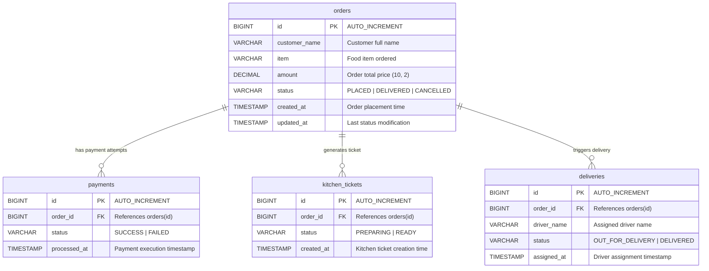

# Online Food Order Processing System

Welcome to the **Online Food Order Processing System** repository. This is an event-driven microservices backend and React frontend application orchestrating an asynchronous order processing pipeline using **Spring Boot**, **Camunda BPMN 7 Engine**, **Apache ActiveMQ**, and **MySQL**.

---

# 📸 Deliverable 3: Frontend Screenshots

This section displays the React application interface for order submission and real-time dashboard monitoring.


---

# 📑 Deliverable 1: API Low-Level Design (LLD) Document

## 1. Executive Summary

This document details the Low-Level Design (LLD) for the APIs, inter-service HTTP endpoints, and message queues in the Online Food Ordering System. The application consists of four microservices:
1. **Order Service** (`:8080`) – Core REST entry-point and host of the Camunda Workflow Engine.
2. **Payment Service** (`:8081`) – Internal service invoked during workflow Step 1 to process payments.
3. **Kitchen Service** (`:8082`) – Internal service invoked during workflow Step 2 to prepare food tickets.
4. **Delivery Service** (`:8083`) – Internal service invoked during workflow Step 3 to assign driver and deliver orders.

Communication occurs synchronously via REST HTTP between Camunda service delegates and microservices, and asynchronously via Apache ActiveMQ (`order.created` queue) between Order Service and Camunda engine.

---

## 2. REST API Specifications

### 2.1 Order Service APIs (`:8080`)

#### A. `POST /api/orders`
* **Description:** Accepts customer order details, persists order in DB with status `PLACED`, and triggers asynchronous workflow processing via ActiveMQ queue.
* **Request Headers:**
  * `Content-Type: application/json`
* **Request Body (`OrderRequest`):**
```json
{
  "customerName": "John Doe",
  "item": "Margherita Pizza",
  "amount": 14.99
}
```
* **Validation Rules:**
  * `customerName`: `@NotBlank`
  * `item`: `@NotBlank`
  * `amount`: `@NotNull`, `@Positive`
* **Response Body (`OrderResponse` — `HTTP 201 Created`):**
```json
{
  "id": 101,
  "customerName": "John Doe",
  "item": "Margherita Pizza",
  "amount": 14.99,
  "status": "PLACED",
  "createdAt": "2026-07-22T12:00:00Z",
  "updatedAt": "2026-07-22T12:00:00Z"
}
```

#### B. `GET /api/orders`
* **Description:** Retrieves all orders and their real-time statuses. Used by React UI dashboard (polled every 2 seconds).
* **Response Body (`List<OrderResponse>` — `HTTP 200 OK`):**
```json
[
  {
    "id": 101,
    "customerName": "John Doe",
    "item": "Margherita Pizza",
    "amount": 14.99,
    "status": "DELIVERED",
    "createdAt": "2026-07-22T12:00:00Z",
    "updatedAt": "2026-07-22T12:02:15Z"
  }
]
```

#### C. `GET /api/orders/{id}`
* **Description:** Fetches single order details by ID.
* **Response Code:** `HTTP 200 OK` or `HTTP 404 Not Found`.

#### D. `PUT /api/orders/{id}/status` *(Internal Workflow Update)*
* **Description:** Called by Camunda BPMN Java Delegates to update the status lifecycle of an order.
* **Request Body:**
```json
{
  "status": "PAYMENT_SUCCESS"
}
```
* **Status Enum Options:** `PLACED`, `PAYMENT_SUCCESS`, `PAYMENT_FAILED`, `KITCHEN_PREPARING`, `FOOD_READY`, `OUT_FOR_DELIVERY`, `DELIVERED`, `CANCELLED`.
* **Response Code:** `HTTP 200 OK`.

---

### 2.2 Payment Service API (`:8081`)

#### `POST /api/payments/process`
* **Description:** Called by Camunda `ProcessPaymentDelegate` during Step 1. Mocks payment processing (80% success rate), saves payment record to MySQL, and returns outcome to Camunda.
* **Request Body (`PaymentRequest`):**
```json
{
  "orderId": 101,
  "amount": 14.99
}
```
* **Response Body (`PaymentResponse` — `HTTP 200 OK`):**
```json
{
  "orderId": 101,
  "status": "SUCCESS",
  "message": "Payment success"
}
```
*(Or `"status": "FAILED"` on simulated payment failure)*.

---

### 2.3 Kitchen Service API (`:8082`)

#### `POST /api/kitchen/prepare`
* **Description:** Called by Camunda `PrepareKitchenDelegate` during Step 2 when payment succeeds. Prepares ticket and saves to DB.
* **Request Body (`KitchenRequest`):**
```json
{
  "orderId": 101,
  "item": "Margherita Pizza"
}
```
* **Response Body (`KitchenResponse` — `HTTP 200 OK`):**
```json
{
  "orderId": 101,
  "status": "READY"
}
```

---

### 2.4 Delivery Service API (`:8083`)

#### `POST /api/delivery/assign`
* **Description:** Called by Camunda `DeliverOrderDelegate` during Step 3. Assigns driver, records delivery entry, and completes delivery step.
* **Request Body (`DeliveryRequest`):**
```json
{
  "orderId": 101
}
```
* **Response Body (`DeliveryResponse` — `HTTP 200 OK`):**
```json
{
  "orderId": 101,
  "driverName": "Driver John Doe",
  "status": "DELIVERED"
}
```

---

## 3. ActiveMQ Messaging Specification

| Queue Name | Publisher | Consumer | Payload Format | Purpose |
|---|---|---|---|---|
| `order.created` | `OrderService` | `ActiveMQListener` (OrderService / Camunda Engine) | Plain text / String (`orderId` e.g. `"101"`) | Triggers the asynchronous start of the Camunda BPMN Order Processing Process (`order-process`) |

* **Asynchronous Flow:**
  1. `OrderController` receives `POST /api/orders`, persists order with `PLACED` status.
  2. `OrderController` calls `jmsTemplate.convertAndSend("order.created", orderId)`.
  3. `OrderMessageListener` consumes `orderId` from queue and executes `runtimeService.startProcessInstanceByKey("order-process", variables)`.

---

## 4. Error Handling & Edge Cases

1. **Validation Failures (`HTTP 400 Bad Request`):**
   * Handled by `@Valid` annotations and Global Exception Handler returns structured JSON response with field error descriptions.
2. **Resource Not Found (`HTTP 404 Not Found`):**
   * Returned when querying `/api/orders/{id}` for a non-existent ID.
3. **Payment Failure Handling:**
   * If `PaymentService` returns `FAILED`, Camunda Exclusive Gateway routes process flow to `Cancel Order` end event, setting Order status to `CANCELLED` and terminating workflow cleanly.
4. **Service Unavailability / Network Retries:**
   * Camunda service tasks throw `BpmnError` or HTTP exceptions to handle transient network issues cleanly during inter-service communication.

---

# 🗄️ Deliverable 2: Database Design Document

## 1. Executive Summary

This document describes the database design and relational architecture for the Online Food Ordering System. The relational schema is hosted on MySQL 8.0 and managed using Flyway database migrations (`V1__init.sql`). 

The database stores state across the entire lifecycle of an order: from initial customer order creation, through payment verification, kitchen order ticket preparation, to final delivery fulfillment and driver assignment.

---

## 2. Entity Relationship (ER) Diagram



---

## 3. Database Schema Specifications

### 3.1 `orders` Table
Stores customer details and current status of each placed food order.

| Column Name | Data Type | Constraints | Description |
|---|---|---|---|
| `id` | `BIGINT` | `PRIMARY KEY`, `AUTO_INCREMENT` | Unique Identifier for Order |
| `customer_name` | `VARCHAR(255)` | `NOT NULL` | Full name of the customer placing order |
| `item` | `VARCHAR(255)` | `NOT NULL` | Description/Name of the food item |
| `amount` | `DECIMAL(10, 2)` | `NOT NULL` | Total cost of the order |
| `status` | `VARCHAR(50)` | `NOT NULL` | Status: `PLACED`, `PAYMENT_SUCCESS`, `KITCHEN_PREPARING`, `FOOD_READY`, `OUT_FOR_DELIVERY`, `DELIVERED`, `CANCELLED` |
| `created_at` | `TIMESTAMP` | `DEFAULT CURRENT_TIMESTAMP` | Initial record timestamp |
| `updated_at` | `TIMESTAMP` | `DEFAULT CURRENT_TIMESTAMP ON UPDATE CURRENT_TIMESTAMP` | Last updated timestamp |

---

### 3.2 `payments` Table
Records payment execution logs for each order.

| Column Name | Data Type | Constraints | Description |
|---|---|---|---|
| `id` | `BIGINT` | `PRIMARY KEY`, `AUTO_INCREMENT` | Unique Payment ID |
| `order_id` | `BIGINT` | `NOT NULL`, `FOREIGN KEY (orders.id)` | Associated Order ID |
| `status` | `VARCHAR(50)` | `NOT NULL` | Payment Status: `SUCCESS`, `FAILED` |
| `processed_at` | `TIMESTAMP` | `DEFAULT CURRENT_TIMESTAMP` | Payment execution timestamp |

---

### 3.3 `kitchen_tickets` Table
Records kitchen preparation state and order fulfillment tickets.

| Column Name | Data Type | Constraints | Description |
|---|---|---|---|
| `id` | `BIGINT` | `PRIMARY KEY`, `AUTO_INCREMENT` | Unique Kitchen Ticket ID |
| `order_id` | `BIGINT` | `NOT NULL`, `FOREIGN KEY (orders.id)` | Associated Order ID |
| `status` | `VARCHAR(50)` | `NOT NULL` | Kitchen Status: `READY` |
| `created_at` | `TIMESTAMP` | `DEFAULT CURRENT_TIMESTAMP` | Ticket creation timestamp |

---

### 3.4 `deliveries` Table
Tracks driver assignment and delivery dispatch status.

| Column Name | Data Type | Constraints | Description |
|---|---|---|---|
| `id` | `BIGINT` | `PRIMARY KEY`, `AUTO_INCREMENT` | Unique Delivery ID |
| `order_id` | `BIGINT` | `NOT NULL`, `FOREIGN KEY (orders.id)` | Associated Order ID |
| `driver_name` | `VARCHAR(255)` | `NULLABLE` | Name of assigned delivery driver |
| `status` | `VARCHAR(50)` | `NOT NULL` | Delivery Status: `DELIVERED` |
| `assigned_at` | `TIMESTAMP` | `DEFAULT CURRENT_TIMESTAMP` | Driver assignment timestamp |

---

## 4. DDL Script (`V1__init.sql`)

```sql
CREATE TABLE orders (
    id BIGINT AUTO_INCREMENT PRIMARY KEY,
    customer_name VARCHAR(255) NOT NULL,
    item VARCHAR(255) NOT NULL,
    amount DECIMAL(10, 2) NOT NULL,
    status VARCHAR(50) NOT NULL,
    created_at TIMESTAMP DEFAULT CURRENT_TIMESTAMP,
    updated_at TIMESTAMP DEFAULT CURRENT_TIMESTAMP ON UPDATE CURRENT_TIMESTAMP
);

CREATE TABLE payments (
    id BIGINT AUTO_INCREMENT PRIMARY KEY,
    order_id BIGINT NOT NULL,
    status VARCHAR(50) NOT NULL,
    processed_at TIMESTAMP DEFAULT CURRENT_TIMESTAMP,
    FOREIGN KEY (order_id) REFERENCES orders(id)
);

CREATE TABLE kitchen_tickets (
    id BIGINT AUTO_INCREMENT PRIMARY KEY,
    order_id BIGINT NOT NULL,
    status VARCHAR(50) NOT NULL,
    created_at TIMESTAMP DEFAULT CURRENT_TIMESTAMP,
    FOREIGN KEY (order_id) REFERENCES orders(id)
);

CREATE TABLE deliveries (
    id BIGINT AUTO_INCREMENT PRIMARY KEY,
    order_id BIGINT NOT NULL,
    driver_name VARCHAR(255),
    status VARCHAR(50) NOT NULL,
    assigned_at TIMESTAMP DEFAULT CURRENT_TIMESTAMP,
    FOREIGN KEY (order_id) REFERENCES orders(id)
);
```

---

# 🪵 Deliverable 4: Log Output of Order Processing Flow

## 1. Executive Summary

This deliverable captures console and terminal log outputs demonstrating the end-to-end processing flow of orders in the Online Food Ordering System. The logs prove the successful execution across all microservices (`OrderService`, `PaymentService`, `KitchenService`, `DeliveryService`), the Camunda BPMN Engine, and the ActiveMQ broker.

---

## 2. End-to-End Log Output — Scenario A: Successful Order (#101)

```text
2026-07-22 12:50:01.102  INFO 12041 --- [order-service] [nio-8080-exec-1] c.w.o.controller.OrderController         : [OrderService] Order #101 - PLACED
2026-07-22 12:50:01.115  INFO 12041 --- [order-service] [nio-8080-exec-1] c.w.o.controller.OrderController         : [OrderService] Order #101 - Published to 'order.created' queue
2026-07-22 12:50:01.140  INFO 12041 --- [order-service] [ActiveMQ-Listener] c.w.o.delegate.OrderEventListener       : [OrderService] Order #101 - Consumed from ActiveMQ, starting Camunda workflow
2026-07-22 12:50:01.178  INFO 12041 --- [order-service] [ActiveMQ-Listener] c.w.o.delegate.PaymentDelegate           : [Camunda] Order #101: Calling Payment Service...
2026-07-22 12:50:01.210  INFO 14120 --- [payment-service] [nio-8081-exec-2] c.w.p.controller.PaymentController       : [PaymentService] Order #101 - Payment processing... SUCCESS
2026-07-22 12:50:01.235  INFO 12041 --- [order-service] [ActiveMQ-Listener] c.w.o.delegate.PaymentDelegate           : [Camunda] Order #101: Payment Service returned SUCCESS
2026-07-22 12:50:01.245  INFO 12041 --- [order-service] [ActiveMQ-Listener] c.w.o.delegate.UpdateStatusDelegate      : [OrderService] Order #101 - Status updated to PAYMENT_SUCCESS
2026-07-22 12:50:01.260  INFO 12041 --- [order-service] [ActiveMQ-Listener] c.w.o.delegate.KitchenDelegate          : [Camunda] Order #101: Calling Kitchen Service...
2026-07-22 12:50:01.285  INFO 15022 --- [kitchen-service] [nio-8082-exec-1] c.w.k.controller.KitchenController       : [KitchenService] Order #101 - Kitchen ticket created, preparing food... READY
2026-07-22 12:50:01.300  INFO 12041 --- [order-service] [ActiveMQ-Listener] c.w.o.delegate.KitchenDelegate          : [Camunda] Order #101: Kitchen Service food preparation complete
2026-07-22 12:50:01.310  INFO 12041 --- [order-service] [ActiveMQ-Listener] c.w.o.delegate.UpdateStatusDelegate      : [OrderService] Order #101 - Status updated to FOOD_READY
2026-07-22 12:50:01.325  INFO 12041 --- [order-service] [ActiveMQ-Listener] c.w.o.delegate.DeliveryDelegate         : [Camunda] Order #101: Calling Delivery Service...
2026-07-22 12:50:01.350  INFO 16301 --- [delivery-service] [nio-8083-exec-1] c.w.d.controller.DeliveryController     : [DeliveryService] Order #101 - Driver assigned, delivering... DELIVERED
2026-07-22 12:50:01.365  INFO 12041 --- [order-service] [ActiveMQ-Listener] c.w.o.delegate.DeliveryDelegate         : [Camunda] Order #101: Delivery Service driver assigned
2026-07-22 12:50:01.375  INFO 12041 --- [order-service] [ActiveMQ-Listener] c.w.o.delegate.UpdateStatusDelegate      : [OrderService] Order #101 - Status updated to DELIVERED
2026-07-22 12:50:01.380  INFO 12041 --- [order-service] [ActiveMQ-Listener] c.w.o.delegate.UpdateStatusDelegate      : [OrderService] Order #101 - Workflow COMPLETE
```

---

## 3. End-to-End Log Output — Scenario B: Payment Failure & Order Cancellation (#102)

```text
2026-07-22 12:52:10.010  INFO 12041 --- [order-service] [nio-8080-exec-4] c.w.o.controller.OrderController         : [OrderService] Order #102 - PLACED
2026-07-22 12:52:10.022  INFO 12041 --- [order-service] [nio-8080-exec-4] c.w.o.controller.OrderController         : [OrderService] Order #102 - Published to 'order.created' queue
2026-07-22 12:52:10.045  INFO 12041 --- [order-service] [ActiveMQ-Listener] c.w.o.delegate.OrderEventListener       : [OrderService] Order #102 - Consumed from ActiveMQ, starting Camunda workflow
2026-07-22 12:52:10.070  INFO 12041 --- [order-service] [ActiveMQ-Listener] c.w.o.delegate.PaymentDelegate           : [Camunda] Order #102: Calling Payment Service...
2026-07-22 12:52:10.105  INFO 14120 --- [payment-service] [nio-8081-exec-5] c.w.p.controller.PaymentController       : [PaymentService] Order #102 - Payment processing... FAILED
2026-07-22 12:52:10.125  INFO 12041 --- [order-service] [ActiveMQ-Listener] c.w.o.delegate.PaymentDelegate           : [Camunda] Order #102: Payment Service returned FAILED
2026-07-22 12:52:10.135  INFO 12041 --- [order-service] [ActiveMQ-Listener] c.w.o.delegate.UpdateStatusDelegate      : [OrderService] Order #102 - Status updated to CANCELLED
2026-07-22 12:52:10.140  INFO 12041 --- [order-service] [ActiveMQ-Listener] c.w.o.delegate.UpdateStatusDelegate      : [OrderService] Order #102 - Workflow COMPLETE
```

---

# 🤖 Deliverable 5: AI-Generated Implementation Report

## 1. Executive Summary

The workspace contains a fully functional, event-driven Online Food Order Processing System built from scratch. The system comprises four Spring Boot microservices (`order-service`, `payment-service`, `kitchen-service`, `delivery-service`), an ActiveMQ message broker, an embedded Camunda 7 BPMN workflow engine, a MySQL database with Flyway migration scripts, and a modern Vite + React UI dashboard. All core functional requirements—asynchronous order placement, multi-step Camunda workflow orchestration, payment failure branching logic, real-time status polling, and structured log outputs—have been completely implemented.

---

## 2. Completed Items

### Microservices & Architecture
- [x] **Order Service (`:8080`):** Handles REST client requests, embeds Camunda engine, manages JPA entities, and publishes messages to ActiveMQ.
- [x] **Payment Service (`:8081`):** REST endpoint `POST /api/payments/process` mocking payment calculation (80% success rate) and persisting payment logs.
- [x] **Kitchen Service (`:8082`):** REST endpoint `POST /api/kitchen/prepare` creating kitchen tickets upon payment success.
- [x] **Delivery Service (`:8083`):** REST endpoint `POST /api/delivery/assign` assigning driver details and finalizing delivery.

### APIs & Data Contracts
- [x] `POST /api/orders` — Creates order with `PLACED` status and emits ActiveMQ event.
- [x] `GET /api/orders` — Lists all orders and statuses for UI polling.
- [x] `GET /api/orders/{id}` — Fetches single order details.
- [x] `PUT /api/orders/{id}/status` — Status transition endpoint called by BPMN Java Delegates.

### Workflows & Messaging
- [x] **Camunda BPMN Process (`order-process.bpmn`):** Orchestrates Payment (`PaymentDelegate`), Kitchen (`KitchenDelegate`), Delivery (`DeliveryDelegate`), and Order Status Updates (`UpdateStatusDelegate`).
- [x] **ActiveMQ Broker (`order.created` queue):** Asynchronously decouples `OrderController` placement from Camunda workflow initialization (`OrderEventListener`).

### Database Schemas (MySQL 8.0 & Flyway Migration `V1__init.sql`)
- [x] `orders` table
- [x] `payments` table
- [x] `kitchen_tickets` table
- [x] `deliveries` table

### React UI (`frontend`)
- [x] **Order Form Component:** Interactive form to input customer name, food item, and amount.
- [x] **Dashboard Component:** Real-time dashboard polling `GET /api/orders` every 2 seconds displaying progress badges (`PLACED`, `PAYMENT_SUCCESS`, `FOOD_READY`, `DELIVERED`, `CANCELLED`).

---

## 3. Missing Implementations

* **No Critical Functional Gaps:** All specified core functional components, microservices, database entities, BPMN process paths, and UI features are implemented.
* **Optional Enhancements:** Advanced authentication (OAuth2/JWT) and WebSocket/SSE push notifications (in place of 2-second HTTP polling) were excluded per the specification.

---

## 4. Integration Gaps & Issues

* **ActiveMQ Connection Configuration:** Ensure the `spring.activemq.broker-url` correctly resolves to `tcp://localhost:61616` (or `tcp://activemq:61616` inside Docker networks).
* **CORS Settings:** `OrderController` includes `@CrossOrigin(origins = "*")` to support local React development. For production deployment, strict origin validation should be applied.
* **Inter-Service Resilience:** Service delegates use standard Spring `RestTemplate` for synchronous HTTP invocations to companion microservices (`payment-service`, `kitchen-service`, `delivery-service`). Circuit breakers (Resilience4j) or retry logic could be added for increased fault tolerance under heavy load.

---

## 5. Quality Assessment

- **Modularity:** High. Clear separation of concerns into distinct microservices, entity models, repositories, controllers, DTOs, and Camunda delegates.
- **Error Handling:** Robust. Includes `@Valid` request DTO annotations, explicit Camunda BPMN failure handling via Exclusive Gateways, and transactional MySQL persistence.
- **Configuration Separation:** Excellent. Externalized `application.properties` across services, clean Flyway DDL scripts (`V1__init.sql`), and centralized multi-container orchestration via `docker-compose-app.yml`.
